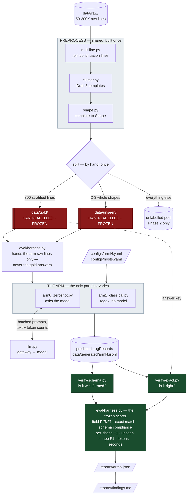
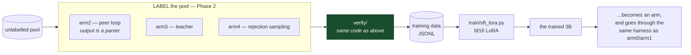

# The pipeline, end to end

One diagram of what actually happens to a log line, from raw text to a number in a
report. Red is frozen and hand-made. Green is deterministic code that judges. Everything
else is ordinary plumbing.

`ARCHITECTURE.md` draws the same system at the level of *techniques*. This draws it at the
level of *files*, which is the level you debug at.

---

## The whole thing

### What of this exists today

| Box | File | Status |
|---|---|---|
| the shared types and JSONL format | `src/contracts.py` | built |
| config loading | `src/config.py` | built |
| the model client | `src/llm.py` | built |
| multiline join, Drain3, shape | `src/preprocess/` | step 6 |
| both verifiers | `src/verify/` | step 4, next |
| the frozen scorer | `src/eval/harness.py` | step 5 |
| arms 0 and 1 | `src/label/` | step 7 |
| `make` targets | `Makefile` | step 8 |
| the gold set itself | `data/gold/` | yours to make, by hand |

Read it as five moves:

1. **Tidy the text.** Continuation lines get joined first, or every later stage fights
   them. Then Drain3 groups lines into templates, and each template gets a shape label.
2. **Split, by hand, once.** 300 lines become the answer key. Two or three whole formats
   are quarantined as `unseen`. The rest is the unlabelled pool that Phase 2 arms train on.
3. **Run one arm.** The harness hands it raw lines and nothing else. An arm is anything
   that turns lines into `LogRecord`s — a prompt, a regex set, or later a fine-tuned model.
4. **Judge with code, twice, separately.** `schema.py` asks *is this well formed?*
   `exact.py` asks *is this right?* Kept apart because well-formed-and-wrong is the failure
   worth seeing: `level="GET"`, `method="INFO"` passes the first and fails the second.
5. **Write the same report every time.** Identical fields for every arm, or the comparison
   is not a comparison.

---

## Where the Phase 2 arms plug in

Nothing above changes. They enter at exactly the same seam.

The trained model is not a new pipeline. It is just another thing that turns lines into
records, so it is scored by the same frozen scorer against the same frozen gold set. That
is the whole reason the boundary sits where it does.

---

## What runs where

| Stage | Machine | How |
|---|---|---|
| preprocess, verify, score | laptop | `make test`, plain CPU |
| arm 1 (regex) | either | no model needed |
| arm 0 (prompting) | Spark | `make label-arm0` — detached, logged |
| Phase 2 labelling and training | Spark | `make label-%` / `make train-%` |
| reading the results | laptop | `make pull-reports` |

---

## Reading the docs against the package

Five documents describe this project and they do not fully agree. Where they conflict, I
followed `PROMPT_phase1.md` (it is the build contract) and noted it. The ones that matter:

**1. `ArmReport` has different fields in `README.md` and `PROMPT_phase1.md`.**
The README's JSON carries `train_wall_clock_s`, `inference_p50_ms`, `inference_p95_ms` and
`peak_vram_mb`, and has no `seed` or `notes`. The Phase 1 contract is the reverse. I built
the Phase 1 contract. Those four are not decoration — the README's own argument is that
cost, not accuracy, justifies a small specialist, and `INFRA.md` makes laptop latency the
deployment-realism check. **Add them in Phase 2 as optional fields with defaults.** Adding
defaulted fields keeps every earlier arm's JSON readable; renaming or removing one does
not.

**2. "Never evaluate on gold" is contradicted by the harness's own job.**
`PROMPT_phase1.md` rule 2 says never train *or evaluate* on gold; the same document then
specifies a harness that "loads gold, runs an arm, scores it". `CLAUDE.md` rule 2 gives the
coherent version: never **train** on gold or unseen. Gold exists to be scored against. The
assertion the harness will actually make is that **no arm's training data intersects gold
or unseen by `line_id`** — which is checkable, unlike the literal wording.

**3. The architecture diagram routes every arm through training. Two of them never train.**
Arm 0 is a prompt and arm 1 is a regex set; neither produces a training set and neither is
fine-tuned. The diagram conflates two different jobs that both get called "an arm": a
**labeller** that manufactures training data for the pool, and a **parser under test** that
gets scored. Arms 0 and 1 are only the second. That is why the Phase 1 pipeline above is
shorter than the picture in `ARCHITECTURE.md`, and it is not a simplification — it is what
the code does.

**4. Preprocessing order is drawn wrong.**
`ARCHITECTURE.md` lists the preprocess box as "Drain3 clustering · shape classifier ·
multiline joining". `PROMPT_phase1.md` is explicit that multiline joining must run *first*,
before anything else. Clustering a half-stack-trace produces a template for a thing that
is not a log line. The diagram above puts it first.

**5. Three different hardware plans.**
`README.md` assumes 12–16GB, QLoRA, a 14B proposer. `INFRA.md` replaces that with a 128GB
Spark, bf16 LoRA and a 30B-A3B MoE. `SERVING.md` explicitly supersedes `INFRA.md` on
serving (vLLM, not Ollama) and revises the model roster again. Precedence is
**SERVING > INFRA > README** for anything about hardware or serving; the README still
governs the *experiment* design — the arm table, the milestones and the one rule.

**6. The base model is not settled.**
`README.md` and `CLAUDE.md` both fix `Qwen2.5-3B-Instruct` across all arms and warn that
changing it silently destroys the comparison. `SERVING.md` suggests Qwen3.5-4B or 2B and
says to benchmark first. Both are defensible; only one can be true after arm 0 runs.
`configs/arm0.yaml` currently says `Qwen2.5-3B-Instruct`. **Decide before the first arm
produces a number, not after.**

**7. Small path disagreements**, resolved toward `PROMPT_phase1.md`: gold lives at
`data/gold/logs_gold.jsonl` (README's name, now used in the configs); `data/generated/` is
flat rather than per-arm; `data/unseen/` exists, despite being absent from the README's
layout, because `unseen_shape_f1` depends on it.
