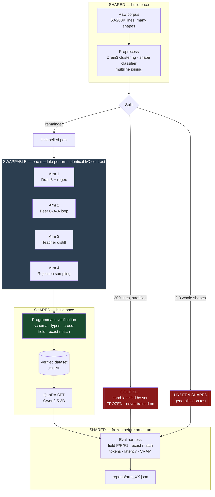
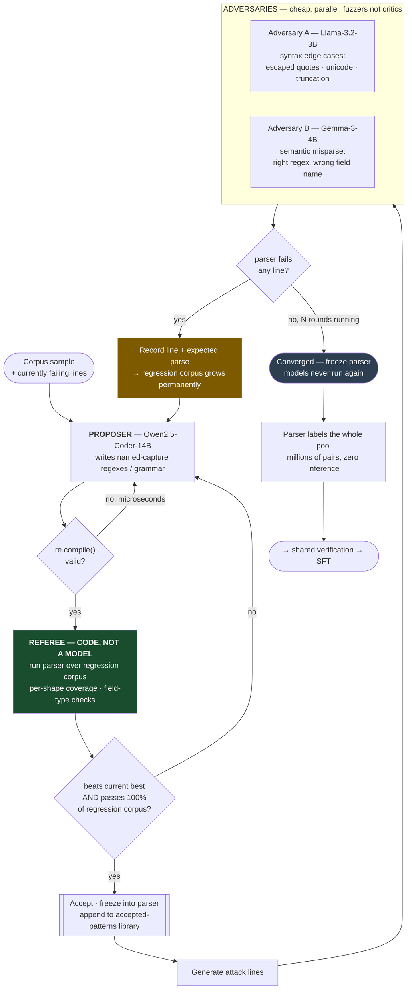
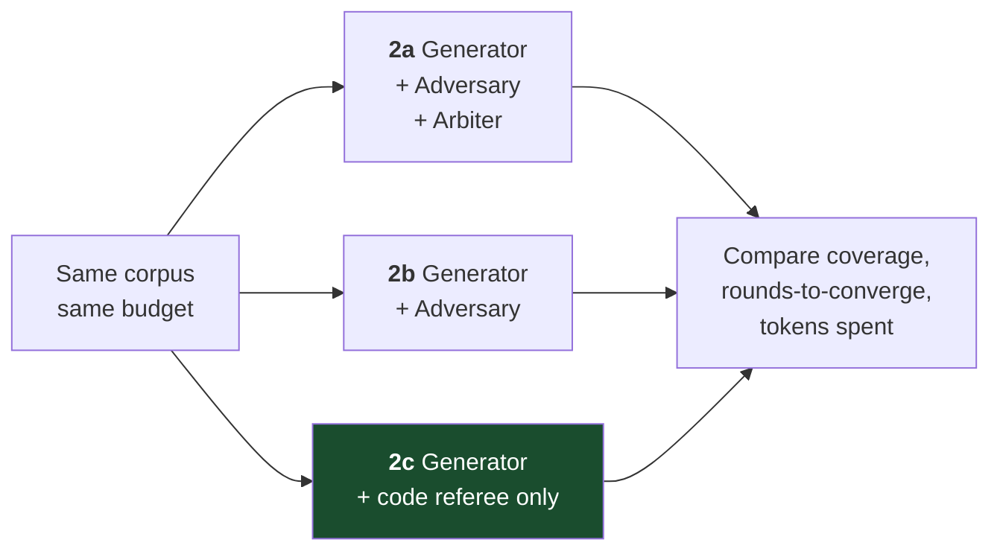
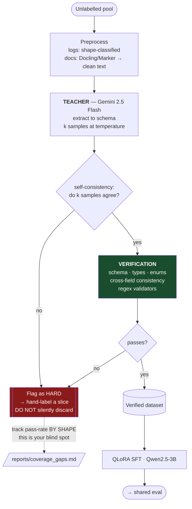
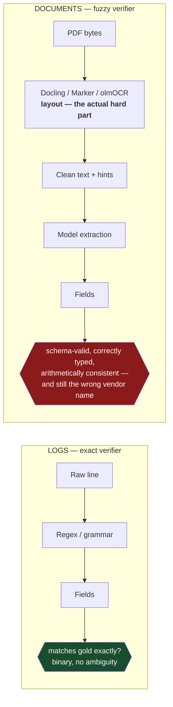

# Architecture

## The structural idea

Three stages are **shared infrastructure** built once and reused by every technique:
preprocessing, verification, and evaluation. Only **label generation** varies by arm.

Draw the boundary here and swapping techniques is a config change. Draw it anywhere else
and each arm becomes a rebuild, the arms stop being comparable, and the comparison — the
entire point of the project — quietly dies.

---

## Technique A — Peer debate loop (Arm 2)

Three same-size models. **The referee is code, not a model.** The loop's output is a
*parser*, and the parser then labels the pool for free.

**Three properties that make this work, all of them structural rather than clever:**

1. **The ratchet.** Every counterexample enters the regression corpus permanently, with
   its expected parse. A new candidate is accepted only if it passes 100% of the corpus.
   The parser can only move forward. Same shape as a git gate — enforcement that doesn't
   depend on the model cooperating.
2. **No conversation history.** Each round hands the proposer the current parser and the
   lines it currently fails — never a transcript of prior argument. Long debate history is
   what makes small models capitulate to whichever position sounded most confident.
   Starving them of it is the design, not an optimisation.
3. **Inference scales with *shapes*, not examples.** Maybe 20–50 shapes, then the frozen
   regexes label the entire corpus for nothing. A per-example debate architecture would
   spend 3 models × 3 rounds × N examples to produce N labels — orders of magnitude more
   compute for a smaller and worse dataset.

### The ablation

If **2c ≈ 2a**, the peer arbiter contributed nothing measurable. That is a real finding,
produced on your data, and it is the thing you actually set out to learn.

---

## Technique B — Teacher distillation (Arm 3)

**The failure mode to instrument for: selection bias.** "Keep only what passes
verification" means training exclusively on the subset your teacher found easy. Hard
layouts, unusual formats and ambiguous fields get dropped *systematically*, and the
training set ends up with a hole shaped precisely like your hardest cases.

Break the pass rate out by shape. If one category passes at 30% while others hit 95%,
hand-label a slice of that category's failures rather than discarding them.

---

## What differs between logs and documents

The small model **never sees raw PDF bytes** — only cleaned text plus layout hints.
Reading order, multi-column, tables spanning pages, scanned pages: that's the layout
tools' job, and they already do it well. A text-only 3B fine-tune cannot learn it and
shouldn't try.

Consequence for the comparison: on documents your verifier catches structural and
arithmetic errors but not wrong-value-right-shape errors, so the gold set carries far more
of the weight. Trust the document numbers less than the log numbers, and say so in the
write-up.
